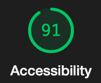

# LAB - 01, 02

## Gallery of Horns

I built an app that displays images and information of horned animals. The app takes information on each animal and displays it in a Gallery of Horns.

### Author: Rhett Chase

### Links and Resources

- [submission PR](https://github.com/rhettchase/code-301-gallery-of-horns)
- chatGPT
- MDN

### Lighthouse Accessibility Report Score

### Time Estimate (lab-02)

#### Feature #1 Display Images

- Estimate of time needed to complete: 1 hr
- Start time: 3 pm
- Finish time: 4:30 pm
- Actual time needed to complete: 1.5 hrs
*note: I already had this set up as part of stretch goal; I updated the .json file. To get this to dynamically render using the Col and Row plus styling, it took longer than expected*

#### Feature #2 Allow Users to Favorite Individual Beasts

- Estimate of time needed to complete: 1.5 hrs
- Start time: 4:30
- Finish time: 5:30
- Actual time needed to complete: 1 hr

#### Feature #3 Bootstrap

- Estimate of time needed to complete: 45 min
- Start time: 5 pm
- Finish time: 6 pm
- Actual time needed to complete: 1 hr
*note: I did this throughout feature 1 and 2 as well*

### Time Estimate (lab-03)

#### Feature #1 Display a Modal

- Estimate of time needed to complete: 2.5 hrs
- Start time: 2 pm
- Finish time:
- Actual time needed to complete:

### Reflections and Comments

#### Lab 01

- I learned that workflow when working with React will need to be different to not throw errors
- I learned how to import and export different components to be used throughout the app using `import` and `export`
- I used the provided `.json` data and iterated over the array of objects by using the `.map()` method
- I used `props` to dynamically render content on the page

#### Lab 02

- I used `bootstrap` to implement styling such as rounded images
- I learned how to use `className` properties in React to style the elements
- I imported `Heart` to create animated heart image that changes when clicked on and when the image is clicked on
  - I added a wrapper `div` around the `Image` and `Heart` components and attached the onClick event to this wrapper div
  - I used the `stopPropagation` method to prevent the click event from propagating to the parent `div`, ensuring that clicking the heart doesn't trigger the click event on the parent div (which increments the count)
- To handle the asynchronous nature of the useState function, I used `useEffect` hook run the `setStatus` logic after the count state has been updated to ensure the correct `status` after each click

#### Lab 03